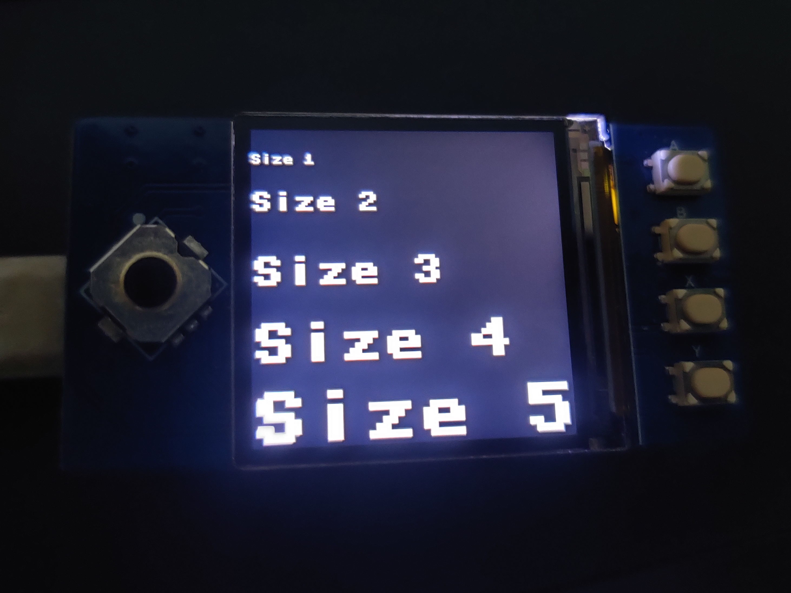

# pico-custom-font

  

Rasberry Pi Pico uses framebuf library for most graphical methods, one such method is text, which draws text on the LCD/OLED display. However, as per their official
<a href="https://docs.micropython.org/en/v1.15/library/framebuf.html#drawing">documentation</a>, framebuf library only supports 8x8 pixel fonts, which are very small
.  
In order display font sizes of different resolutions such as, 16x16, 32x32 and so on, a new method named <b>write_text</b> has been created in the <b>LCD_1inch3</b> class present inside the <a href='lcd_lib.py'>lcd_lib.py</a> file.  
The usage of this method has been demonstrated in <a href='example.py''>example.py</a>.
   
 NOTE: This method has only been tested on Waveshare 1.3" LCD Hat, however since most OLED and LCD panels use frambuf as their base class, this method should work with them aswell.
 
